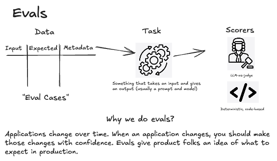
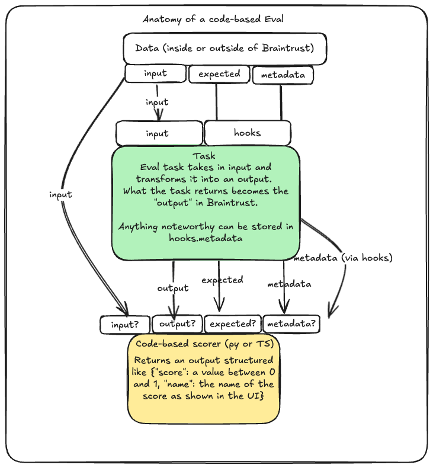
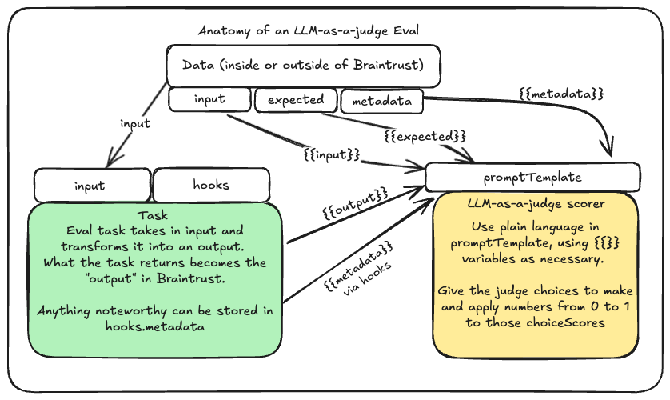

# Braintrust Evaluations Tutorial - Python

This tutorial demonstrates how to perform AI and LLM evaluations using [Braintrust](https://www.braintrust.dev) with Python.

## 🚀 Quick Start

### Prerequisites

- Python 3.8+
- [uv](https://docs.astral.sh/uv/) package manager
- OpenAI API key
- Braintrust account and API key

### Installation

1. **Install uv (if not already installed):**
   ```bash
   curl -LsSf https://astral.sh/uv/install.sh | sh
   ```

2. **Install dependencies:**
   ```bash
   cd py
   uv sync
   ```

2. **Set up environment variables:**   
   Edit `.env` and add your API keys:
   ```env
   BRAINTRUST_API_KEY=your_braintrust_api_key_here
   OPENAI_API_KEY=your_openai_api_key_here
   BRAINTRUST_PROJECT=a_unique_project_name
   PREFERRED_MODEL=gpt-4o-mini
   ```

3. **Load your sample Braintrust environment:**
   ```bash
   uv run python src/setup/braintrust_setup.py
   ```

   This will load a prompt and a dataset into a your Braintrust project named after your environment variable BRAINTRUST_PROJECT.

## 📚 Tutorial Overview

This tutorial covers several key evaluation scenarios:

### 1. AI Proxy (`src/basics/ai_proxy.py`)
- **Task**: Using Braintrust AI proxy
- **Learning**: Model configuration, API setup

### 2. Using Braintrust as a Prompt Store (`src/basics/prompt_building.py`)
- **Task**: Building and using prompts
- **Learning**: Prompt templates, variable substitution

### 3. Using AutoEvals (`src/evals/00_using_autoevals/using_autoevals.py`)
- **Task**: Basic evaluation with AutoEvals
- **Learning**: Built-in scoring functions

### 4. Customizing AutoEvals (`src/evals/01_customizing_autoevals/customizing_autoevals.py`)
- **Task**: Using AutoEvals where customization is needed
- **Learning**: Creating custom evaluators

### 5. Using Braintrust assets (`src/evals/02_use_braintrust_objects/use_braintrust_objects.py`)
- **Task**: Calling datasets and functions directly from Braintrust
- **Learning**: How to use Braintrust as a central store for datasets, prompts, and functions

### 6. Writing custom scorers (`src/evals/03_write_custom_scorers/write_custom_scorers.py`)
- **Task**: Write custom scorers
- **Learning**: How to to use inputs, outputs, expected outputs, and metadata in scorers.

## Anatomy of custom scorers
### What is an Eval?


### Code-based custom scorers


### Custom LLM-as-a-judge scorers


## 🔧 Running Evaluations

```bash
# Export your Braintrust API key
export BRAINTRUST_API_KEY=<YOUR_API_KEY>

# Run evaluations
uv run python -m braintrust eval src/evals/00_using_autoevals/using_autoevals.py
``` 